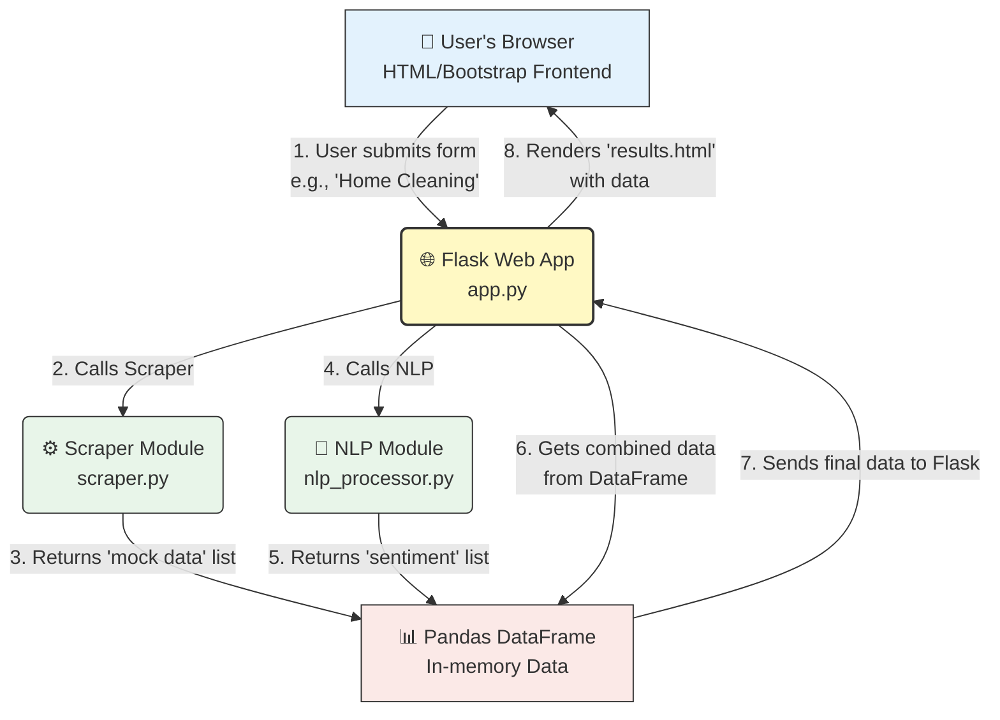
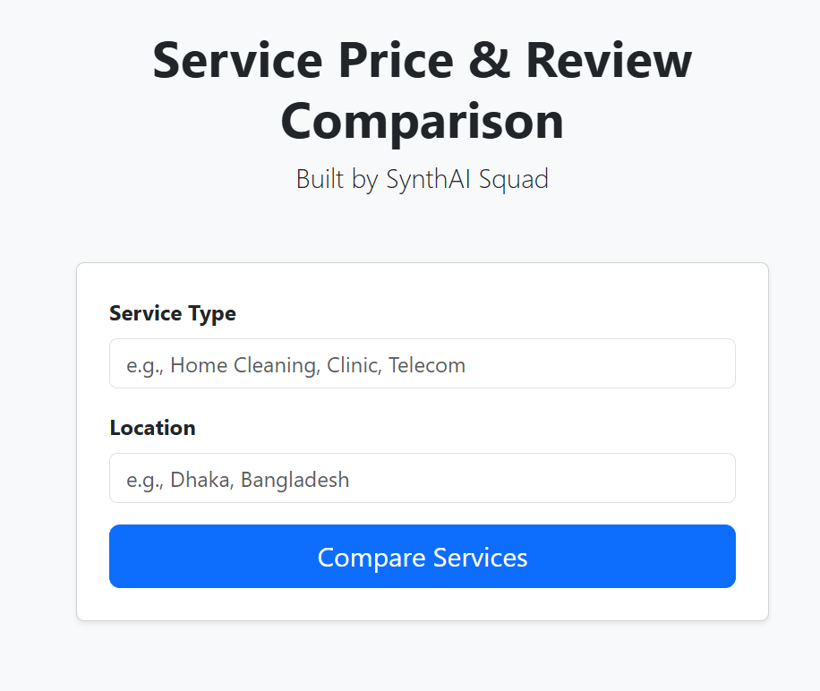

#  SynthAI Squad: Automatic Service Price & Review Comparison

**Project for the SOLVIO AI Hackathon**

Our platform helps users make informed decisions by automatically gathering, analyzing, and comparing prices and reviews for various local services.


## The Problem

Finding the best value for local services (like cleaning, repairs, or clinics) is a manual, time-consuming, and frustrating process. Users have to:
* Browse multiple websites.
* Manually collect prices and contact info.
* Sift through dozens of reviews to see if a service is trustworthy.

This lack of a centralized, automated comparison tool leads to poor decision-making and wasted time.

## Our Solution

Our **AI-Powered Comparison Platform** automates this entire process.

1.  **User Input:** The user enters a service they need (e.g., "Home Cleaning") and their location.
2.  **AI-Powered Scraping:** Our system intelligently gathers service details, prices, and text-based reviews from multiple online sources.
3.  **AI-Powered Analysis:** We use **Natural Language Processing (NLP)** to analyze the sentiment (Positive, Negative, Neutral) of each review, providing an at-a-glance summary of service quality.
4.  **Clear Comparison:** The user is presented with a clean, simple, side-by-side comparison table, allowing them to choose the best service based on price, rating, *and* AI-analyzed sentiment.

This directly addresses the hackathon's "Problem-to-solution flow" and "AI/automation value" criteria.

> **Note:** This is a **prototype** demonstration focusing on local services. The full-scale implementation will expand to cover **all kinds of services** as well as **products from e-commerce platforms**, enabling comprehensive price comparisons and value analysis across multiple categories and marketplaces.

## Tech Stack & System Architecture

This project is built on a modern, scalable stack:

* **Backend:** **Python** & **Flask** (for the web server and API)
* **Web Scraping:** **BeautifulSoup** & **Requests** (to gather data)
* **Data Handling:** **Pandas** (to structure and organize data)
* **AI / NLP:** **SpaCy** & **SpacyTextBlob** (for sentiment analysis of reviews)
* **Frontend:** **HTML**, **CSS**, & **Bootstrap** (for a clean, responsive UI)
* **Version Control:** **Git** & **GitHub**

### Architecture Diagram




## How to Run This Project Locally

Follow these steps to get the prototype running on your machine.

1.  **Clone the repository:**
    ```bash
    git clone [https://github.com/hijbullahx/SynthAI-Squad_AutomaticPriceComparison.git](https://github.com/hijbullahx/SynthAI-Squad_AutomaticPriceComparison.git)
    cd SynthAI-Squad_AutomaticPriceComparison
    ```

2.  **Create and activate a Python virtual environment:**
    ```bash
    # Create the environment
    python -m venv venv
    
    # Activate on Windows
    venv\Scripts\activate
    
    # Activate on macOS/Linux
    # source venv/bin/activate
    ```

3.  **Install the required libraries:**
    ```bash
    pip install -r requirements.txt
    ```

4.  **Download the SpaCy NLP model:**
    ```bash
    python -m spacy download en_core_web_sm
    ```

5.  **Run the Flask application:**
    ```bash
    python app.py
    ```

6.  **Open your browser** and go to: `http://127.0.0.1:5000`

---

## Meet the Team: SynthAI Squad

We are a team of beginner developers and researchers passionate about using AI to solve real-world problems.

* **Md. Taher Bin Omar Hijbullah**
* **Farhida Islam Toushi** 
* **Md. Masud Rana**
* **Md. Rony Mia** 

*A collaboration between the International University of Business Agriculture and Technology (IUBAT) and Manarat International University.*


## Screenshots

### Homepage


### Comparison Results


